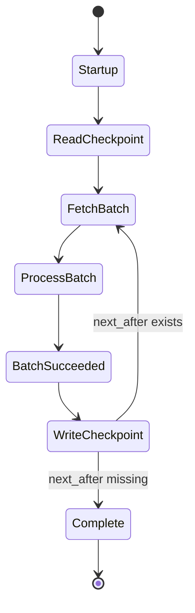

# Checkpoint Lifecycle

```mermaid
stateDiagram-v2
    [*] --> Startup
    Startup --> ReadCheckpoint
    ReadCheckpoint --> FetchBatch
    FetchBatch --> ProcessBatch
    ProcessBatch --> BatchSucceeded
    BatchSucceeded --> WriteCheckpoint
    WriteCheckpoint --> FetchBatch: next_after exists
    WriteCheckpoint --> Complete: next_after missing
    Complete --> [*]
```
