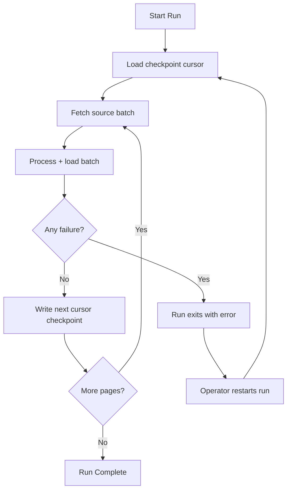

# Failure Recovery Flow

```mermaid
flowchart TD
    A[Start Run] --> B[Load checkpoint cursor]
    B --> C[Fetch source batch]
    C --> D[Process + load batch]
    D --> E{Any failure?}
    E -- No --> F[Write next cursor checkpoint]
    F --> G{More pages?}
    G -- Yes --> C
    G -- No --> H[Run Complete]
    E -- Yes --> I[Run exits with error]
    I --> J[Operator restarts run]
    J --> B
```
