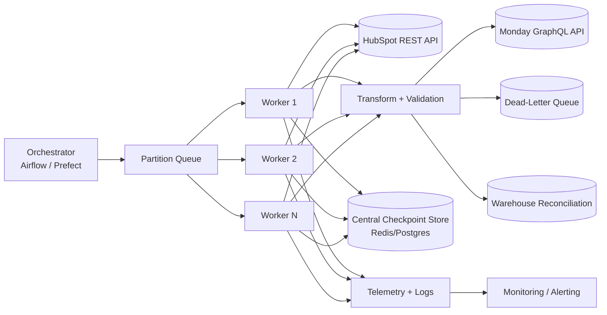

# Future Scalable Architecture

```mermaid
flowchart LR
    O[Orchestrator<br/>Airflow / Prefect] --> Q[Partition Queue]
    Q --> W1[Worker 1]
    Q --> W2[Worker 2]
    Q --> WN[Worker N]

    W1 --> HS[(HubSpot REST API)]
    W2 --> HS
    WN --> HS

    W1 --> TF[Transform + Validation]
    W2 --> TF
    WN --> TF

    TF --> MO[(Monday GraphQL API)]
    TF --> DLQ[(Dead-Letter Queue)]

    W1 --> CS[(Central Checkpoint Store<br/>Redis/Postgres)]
    W2 --> CS
    WN --> CS

    W1 --> OBS[Telemetry + Logs]
    W2 --> OBS
    WN --> OBS

    OBS --> MON[Monitoring / Alerting]
    TF --> WH[(Warehouse Reconciliation)]
```
