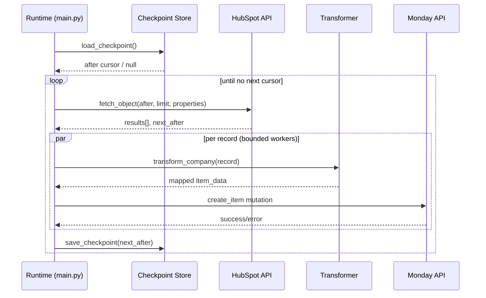

# Migration Flow

```mermaid
sequenceDiagram
    participant R as Runtime (main.py)
    participant C as Checkpoint Store
    participant H as HubSpot API
    participant T as Transformer
    participant M as Monday API

    R->>C: load_checkpoint()
    C-->>R: after cursor / null

    loop until no next cursor
        R->>H: fetch_object(after, limit, properties)
        H-->>R: results[], next_after
        par per record (bounded workers)
            R->>T: transform_company(record)
            T-->>R: mapped item_data
            R->>M: create_item mutation
            M-->>R: success/error
        end
        R->>C: save_checkpoint(next_after)
    end
```
