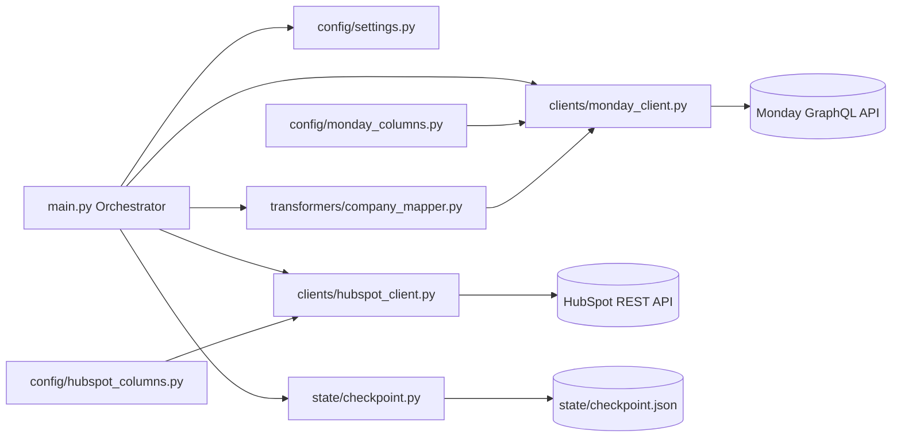

# Overall Architecture

```mermaid
flowchart LR
    A[main.py Orchestrator] --> B[config/settings.py]
    A --> C[state/checkpoint.py]
    A --> D[clients/hubspot_client.py]
    A --> E[transformers/company_mapper.py]
    A --> F[clients/monday_client.py]

    D --> HS[(HubSpot REST API)]
    F --> MO[(Monday GraphQL API)]
    C --> CP[(state/checkpoint.json)]

    G[config/hubspot_columns.py] --> D
    H[config/monday_columns.py] --> F
    E --> F
```
