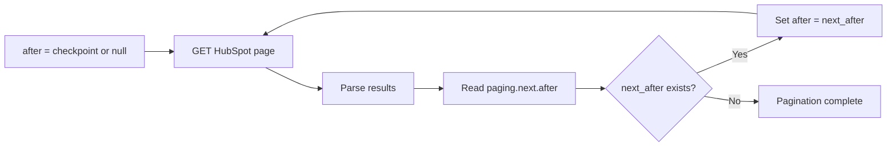

# Pagination Lifecycle

```mermaid
flowchart LR
    A[after = checkpoint or null] --> B[GET HubSpot page]
    B --> C[Parse results]
    C --> D[Read paging.next.after]
    D --> E{next_after exists?}
    E -- Yes --> F[Set after = next_after]
    F --> B
    E -- No --> G[Pagination complete]
```
